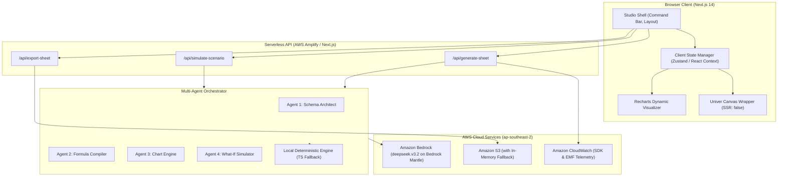

# 06 — System Architecture

> **Traceability**: Implements `REQ-NF-001`, `REQ-NF-003`, `REQ-NF-004`, `REQ-NF-005`.

---

## 1. Architectural Style

SheetBrain AI adopts a **Hybrid Serverless Architecture**:
* **Client Layer**: Next.js 14 App Router (React, Tailwind CSS, Univer Office SDK, Recharts).
* **API / Orchestration Layer**: Next.js Serverless Edge/Node Route Handlers orchestrating multi-agent tasks.
* **AI Cognitive Engine**: Amazon Bedrock running `deepseek.v3.2` on Bedrock Mantle (`ap-southeast-2`), with Bedrock SDK multi-model support.
* **Deterministic Execution Engine**: Custom TypeScript parser for formula syntax tree validation and local instant fallback.
* **Hosting**: AWS Amplify with global CDN.

---

## 2. Component Diagram

---

## 3. Key Architectural Decisions (ADR Summary)

* **Decision 1: Client-Side Only Univer Rendering** (Prevents Node.js SSR crash).
* **Decision 2: Formula Delegation Pattern** (LLM emits formula syntax, browser/canvas calculates numeric values).
* **Decision 3: Hybrid Fallback Protocol** (Guarantees zero-error state if Bedrock encounters rate limits).
