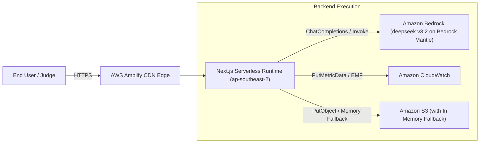

# 09 — AWS Cloud Architecture & Infrastructure Plan

> **Traceability**: Fulfills `REQ-NF-003`, `REQ-NF-007`, and Hackathon Ship Gate.

---

## 1. AWS Services Inventory

| # | AWS Service | Purpose in SheetBrain AI |
|:---|:---|:---|
| 1 | **AWS Amplify Hosting** | Hosts the Next.js 14 web application with automatic CI/CD and CloudFront edge distribution. |
| 2 | **Amazon Bedrock** | Multi-agent reasoning brain utilizing `deepseek.v3.2` on Amazon Bedrock Mantle in Sydney (`ap-southeast-2`), with Bedrock SDK multi-model fallback. |
| 3 | **Amazon CloudWatch** | Application metrics, generation latency tracking, and error observability via SDK & Embedded Metric Format (EMF). |
| 4 | **Amazon S3 (with In-Memory Fallback)** | Dual-tier workbook snapshot storage via `/api/storage`. Persists to Amazon S3 (`ap-southeast-2`) when bucket credentials exist, with automatic zero-crash in-memory fallback for unauthenticated environments. |
| 5 | **AWS IAM** | Scoped execution policies following least-privilege principles without exposed secrets. |

---

## 2. Infrastructure Flow Diagram

---

## 3. Approved Architectural Confirmations [DECIDED & IMPLEMENTED]

* **[APPROVED] AWS Region Selection (`ap-southeast-2`)**: Project assigned region is `ap-southeast-2` (Sydney) per AWS Hackathon Project guidelines. All regional resources (Bedrock, S3 snapshots, CloudWatch EMF) strictly target `ap-southeast-2`.
* **[APPROVED] Persistence Architecture (Dual-Tier S3 + Client LocalStorage)**: Dual-tier persistence with client-side zero-latency LocalStorage (`sheetbrain_wb_*`) and Amazon S3 JSON snapshots via `/api/storage` with zero-crash in-memory fallback. (Fulfills REQ-F-006, REQ-NF-003).
